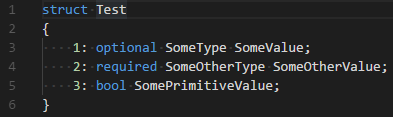
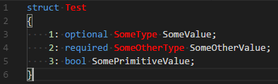

# Bond

Providing syntax highlighting for Microsoft's Bond language's files.

## Patch your theme

If the theme you are using haven't provide a color for scope "entity.name.type", you will see there's no highlight for type token:



To resolve this, you should manually customize your color theme in your user/workspace settings following [this guide](https://code.visualstudio.com/docs/getstarted/themes#_customizing-a-color-theme). For example:

```json
"textMateRules": [
    {
        "scope": "entity.name.type",
        "settings": {
            "foreground": "#FF0000"
        }
    }
]
```

Per-theme settings:

```json
"editor.tokenColorCustomizations": {
    "[Visual Studio Dark]": {
        "textMateRules": [
            {
                "scope": "entity.name.type.bond",
                "settings": {
                    "foreground": "#FF0000"
                }
            }
        ]
    }
}
```

Dot forget to replace the "Visual Studio Dark" with your theme's name. After that, the file should looks like this:

